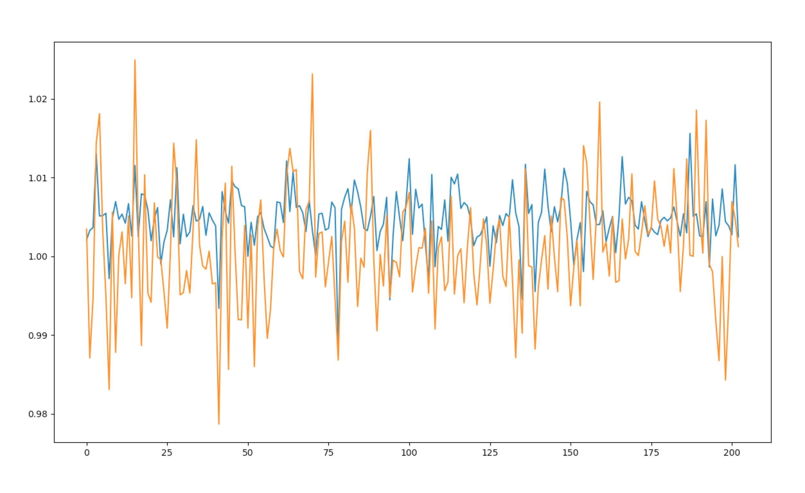
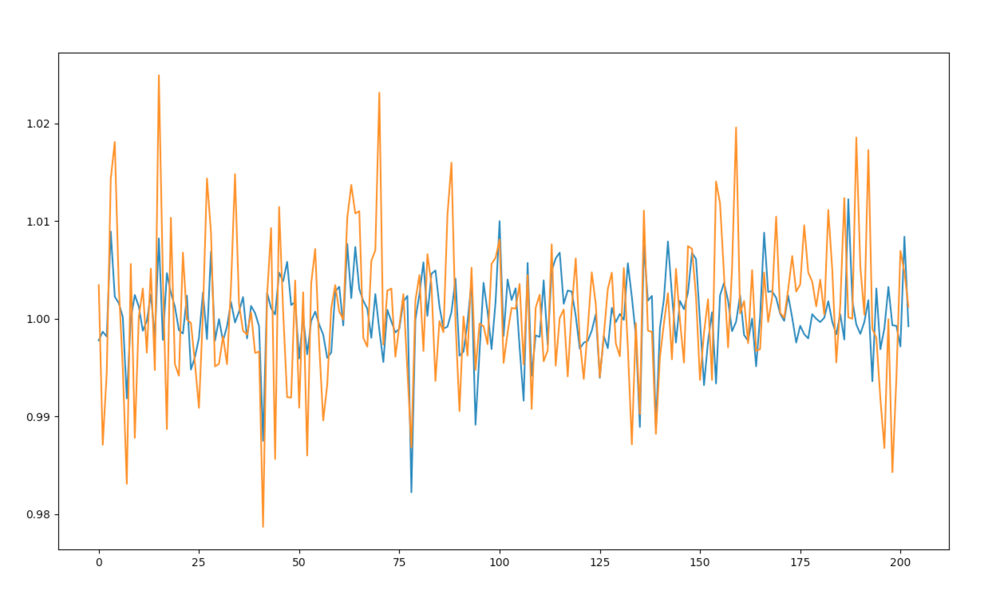

# Machine Learning Nanodegree

## Capstone Project
Takayoshi Nishida  
December 2, 2017

## I. Definition

Predicting the stock price has been researched for long. Now many people try to predict stock price with the machine learning algorithms, but there is not a single answer for this and it is still challenging problem.

It is also known that every country's stock market influences each other. In this project, I am going to predict the stock price in Japan with the data of US stock price and USD/JPY exchange rates.

### Project Overview

The goal of this project is to predict the change rate of the close price of Nikkei 225 index compared to the previous day. Nikkei 225 is a stock market index for the Tokyo Stock Exchange in Japan. 

I have an hypothesis that the Nikkei 225 has a strong correlation with the close price of US stock price and JPY/USD currency exchange rate. So, I am going to predict the change rate of the Nikkei 225 Based on its historical data, NASDAQ and USD/JPY exchange rates.

### Problem Statement

The problem I try to solve is predicting the change rate of the Nikkei 225 and this is regression problem.

The target variable is the Nikkei 225's relative change rate from the previous day. For example, in case the Nikkei 225 index close price is "21450.04" and it was "21374.66" at the previous day, the relative change rate is ("21450.04" / "21374.66" ) ≒ 1.00352. Then, it is possible to know the error between the predicted rate and the actual rate.

From the Mitchell’s definition of a machine learning task, tihs problem can be defined as following. 
>Definition: A computer program is said to learn from experience E with respect to some class of tasks T and performance measure P, if its performance at tasks in T, as measured by P, improves with experience E.

- Task (T): Predict the change rate of Nikkei 225 of the next day.
- Experience (E): History data of Nikkei 225, NASDAQ and currency exchange (JPY/USD)
- Performance (P): Mean squared error between predicted value and the actual value

------------------
Definition: A computer program is said to learn from experience E with respect to some class of tasks T and performance measure P, if its performance at tasks in T, as measured by P, improves with experience E.
------------------

### Metrics

I use MSE (Mean Squared Error) to evaluate the prediction. To lessen the error between the prediction and the actual, I think the MSE is suitable for this problem. 

## II. Analysis

### Data Exploration

The data I am going to use is Nikkei 225, NASDAQ and USD/JPY currency data.

#### 1. Nikkei 225 

The data starts from January 1950 to current date. This data can be obtained at Quandl.
- https://www.quandl.com/data/NIKKEI/INDEX-Nikkei-Index

The input feature data is the change rate from the previous day of Nikkei 225.

#### 2. NASDAQ Index

The data starts from January 2003 to current date. This data can be obtained at Quandl.
- https://www.quandl.com/data/NASDAQOMX/COMP-NASDAQ-Composite-COMP

The input feature data is the change rate from the previous day of the NASDAQ index.

#### 3. Currency Exchange - JPY/USD

The data starts from March 1991 to current date. This data can be obtained at Quandl.
- https://www.quandl.com/data/CURRFX/USDJPY-Currency-Exchange-Rates-USD-vs-JPY

The input feature data is the change rate from the previous day of the JPY/USD exchange rate.

### Exploratory Visualization

These are the example of the original data.

#### Nikkei data

```python
         Date  Open Price  High Price  Low Price  Close Price
0  2017-11-24    22390.14    22567.20   22381.01     22550.85
1  2017-11-22    22601.55    22677.34   22513.44     22523.15
2  2017-11-21    22456.79    22563.25   22416.48     22416.48
3  2017-11-20    22279.98    22410.24   22215.07     22261.76
4  2017-11-17    22603.30    22757.40   22319.12     22396.80
```

#### Nasdaq data

```python
   Trade Date  Index Value     High      Low  Total Market Value
0  2017-11-24      6889.16  6890.02  6873.74        1.032920e+13   
1  2017-11-22      6867.36  6874.52  6859.28        1.029596e+13   
2  2017-11-21      6862.48  6862.66  6820.02        1.029101e+13   
3  2017-11-20      6790.71  6795.83  6779.49        1.018278e+13   
4  2017-11-17      6782.79  6797.75  6777.43        1.017850e+13

   Dividend Market Value  
0             81506001.0  
1            536745500.0  
2            169687729.0  
3            151733686.0  
4            284443422.0  
```

#### Currency data

```python
         Date        Rate  High (est)   Low (est)
0  2017-11-27  111.508003  111.540001  111.540001
1  2017-11-24  111.253998  111.571999  111.259003
2  2017-11-23  111.313004  111.376999  111.070999
3  2017-11-22  112.341003  112.343002  111.510002
4  2017-11-21  112.551003  112.699997  112.183998
```

All these 3 data has the close price.

Usually each market opens for the weekday, but the market is closed for the holidays and it's different between Japan and US. So I remove the data if at lease one of the markets was closed.

### Algorithms and Techniques

The solution to this problem is to apply LSTM (Long short-term memory) to predict the Nikkei 225 index of the next day. LSTM is a one kind of the RNN (Recurrent neural network).

This is a type of time-series problem and LSTM has the advantages to solve the time-serires problem. LSTM can remember the past values better.

I apply the technique that is called "sliding window" for time series data. I will input the data of input_size: N (days). It will input the data within N days (including Nikkei 225, NASDAQ and currency exchange) as a feature data. 

### Benchmark

Benchmark model is made by the [DummyClassifier](http://scikit-learn.org/stable/modules/generated/sklearn.dummy.DummyClassifier.html). The MSE (Mean Squared Error) of the prediction should be less than the benchmark score.

## III. Methodology

### Data Preprocessing

First step is preprocess the each data (Nikkei 225, NASDAQ and USD/JPY currency data).

```python
# main.py

# Data Preprocessing
dropping_features_for_nikkei = ['Open Price', 'High Price', 'Low Price']
dropping_features_for_nasdaq = ['High', 'Low', 'Total Market Value', 'Dividend Market Value']
dropping_features_for_currency = ['High (est)', 'Low (est)']

nikkei_data = DataPreprocessor(nikkei_data_org).preprocess_data(dropping_features_for_nikkei)
nasdaq_data = DataPreprocessor(nasdaq_data_org).preprocess_data(dropping_features_for_nasdaq)
currency_data = DataPreprocessor(currency_data_org).preprocess_data(dropping_features_for_currency)
```

Here `DataPreprocessor` class preprocess the data. (`data_preprocessor.py`)
`preprocess_data` method does:
- Drop the unnecessary features
- Rename columns (to 'date' and 'ClosePrice')
- Convert string 'date' to datetime 'date'
- Calculate change rate of the close price

Next, merge all 3 data to 1 data. After that, drop the rows if the data does not have a value (because of holidays).

```python
# main.py

merged_data = DataPreprocessor.merge(nikkei_data, nasdaq_data, currency_data)
data = merged_data.dropna()
```

Preprocessed data is like this:

```python
         date    nikkei    nasdaq  currency
0  2013-01-22  0.996482  1.002702  0.993557
1  2013-01-23  0.979184  1.003337  0.988047
2  2013-01-24  1.012766  0.992615  1.000576
3  2013-01-25  1.028790  1.006175  1.022330
6  2013-01-28  0.990634  1.001457  1.000000
7  2013-01-29  1.003918  0.999797  0.992114
8  2013-01-30  1.022751  0.996401  1.003648
9  2013-01-31  1.002223  0.999943  1.002544
10 2013-02-01  1.004729  1.011766  1.007537
13 2013-02-04  1.006166  0.984923  1.000000
```

### Splitting the data

`DataSplitter` class splits the data to train, validation and test. (`data_splitter.py`)

```python
# main.py

# Split the data
data_train, data_val, data_test = DataSplitter.split_to_train_val_test(data)
x_train, y_train = DataSplitter.split_to_x_and_y(data_train, timesteps=timesteps)
x_val, y_val = DataSplitter.split_to_x_and_y(data_val, timesteps=timesteps)
x_test, y_test = DataSplitter.split_to_x_and_y(data_test, timesteps=timesteps)
```

Since this is time-series data, the data are not independent each other.
So it should be avoided to extract validation data or test data randomly.
Instead, I'm going to split the data by time. 

I decided to split the data as following:
- Train: "2003-01-22" to "2015-12-31"
- Validation: "2016-01-01" to "2016-12-31"
- Test: "2017-01-01" to 2017-11-24"

Now the data samples are:
- 3060 samples for train
- 227 samples for validation
- 203 samples for test

### Implementation

#### Building the model

I am going to build the model with LSTM (Long short-term memory).

```python
# main.py
model = LSTMModel(timesteps, hidden_neurons).build()
```

At first, I build the simple model.

1st layer is LSTM with hidden units: 50. And flatten it and finally dense it with lenear activation.  

```python
# Output of model.summary()
_________________________________________________________________
Layer (type)                 Output Shape              Param #   
=================================================================
lstm_1 (LSTM)                (None, 10, 50)            10800     
_________________________________________________________________
flatten_1 (Flatten)          (None, 500)               0         
_________________________________________________________________
dense_1 (Dense)              (None, 1)                 501       
_________________________________________________________________
activation_1 (Activation)    (None, 1)                 0         
=================================================================
Total params: 11,301
Trainable params: 11,301
Non-trainable params: 0
```

#### Fitting the model

```python
# main.py
model.fit(x_train, y_train,
          batch_size=batchsize, epochs=epochs, validation_data=(x_val, y_val))
```

I fit the model with this configurations: 

- timesteps = 10 (days: sequence of the sliding window)
- hidden_neurons = 50 (number of hidden units)
- epochs = 100 (300 later)
- batchsize = 10

### Refinement

I started to fit the model with epochs: 10 but it's not enough to fit. I could see the MSE score still keep going down so I changed it to 100. After that I tried epochs with 300 too to compare the result.

## IV. Results

### Model Evaluation and Validation

#### Training with epochs: 100

```python
Completed Prediction.
(203, 2)
   predicted_nikkei  actual_nikkei
0          1.002065       1.003443
1          1.003285       0.987100
2          1.003638       0.994546
3          1.013035       1.014345
4          1.005125       1.018097
5          1.005163       1.003351
6          1.005462       0.994938
7          0.997152       0.983091
8          1.004840       1.005606
9          1.006951       0.987806

Evaluation score is 6.138374768395386e-05
Dummy evaluation score is 0.0002681380814638387
This prediction model's MSE is 22.892588530820866 percent compared to benchmark. (smaller is better)
```

#### Training with epochs: 300

```python
Completed Prediction.
(203, 2)
   predicted_nikkei  actual_nikkei
0          0.997783       1.003443
1          0.998673       0.987100
2          0.998173       0.994546
3          1.008930       1.014345
4          1.002257       1.018097
5          1.001599       1.003351
6          1.000174       0.994938
7          0.991833       0.983091
8          0.999994       1.005606
9          1.002434       0.987806
203/203 [==============================] - 0s 221us/step
Evaluation score is 4.7810021372829685e-05
Dummy evaluation score is 0.0002681380814638387
This prediction model's MSE is 17.83037348213345 percent compared to benchmark. (smaller is better)
```

As the results show, the both evaluation score is much lower than the dummy evaluation score. Result based on the training with epochs: 100 got 22.8% MSE and it with epochs: 300 got 17.8% MSE.

I think this model works well and it could predict based on the LSTM.

### Justification

Compared to the benchmark (made by dummy classifier), this prediction model lessen the MSE (Mean Squared Error) more than 80%. I think this is significant result as it is quite difficult to predict the next day's change rate.

## V. Conclusion

### Free-Form Visualization

- Prediction/Actual with Epochs: 100
 
(Orange is actual / Blue is predicted)

- Prediction/Actual with Epochs: 300
 
(Orange is actual / Blue is predicted)

This is the comparison between predicted change rate and actual change rate.

I noticed that the actual change rate is larger (high volatility) and the predicted one is relatively smaller (low volatility). But the remarkable result is that it predicts very well for the big big drop and some of the rising. Of course it does not work well for some days, but as I see the graph I think the prediction results fit with the actual very well. 

### Reflection

The important point to predict the time-series data is to avoid the look ahead bias. The time-series data affects each other. The values in the past affects to the value of the next day. This time, I split the data by the period so I believe I could avoid the look ahead bias.

And about building the model, I decided to train the model with the simpler model, but the difficult point is how to find the best model. This model has only 1 LSTM layer (with 50 hidden units) and dense it to output feature.
But, based on the purpose of this project, it is to investigate my hypothesis that there should be correlation between some countries stock price and currency data, and I believe I could achieve my target.

### Improvement

It may improve the result by using another evaluation metrics. I evaluate the model by the mean squared error. To consider buying or not buying the stock, it is important to know the stock price will rise or fall. But this implementation minimize the error so that it may end up with incorrect conclusion. Even if the error is small, it is more important to know whether the stock rises or fall.

About generalization of this implementation, I think it can be generally used for other stock data. Just dropping the unnecessary data, and calculate the change rate then you can input those feature data and train the model. 
